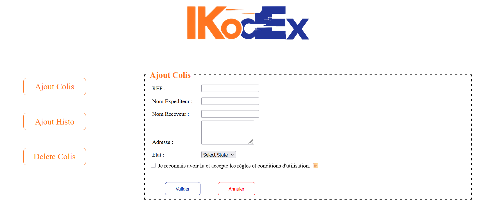
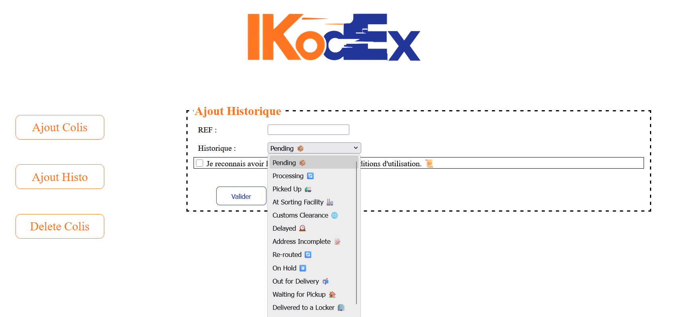
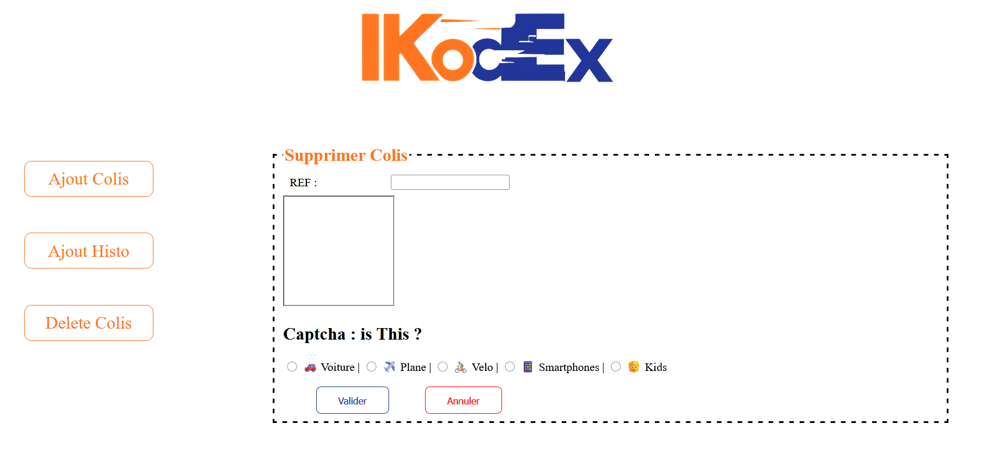

# Delivery-Manager

## Description
Delivery-Manager is a web application that allows logistics companies to efficiently manage and track shipments. Users can add new packages, update shipment history, and remove packages from the system. The application includes client-side validation and CAPTCHA verification to ensure data integrity and prevent automated submissions.

## Features
- **Add a Package**: Register a new shipment with details such as reference code, sender name, address, and status.  
- **Add Shipment History**: Record updates or changes to a package with timestamps and descriptions.  
- **Delete a Package**: Remove a package along with all associated information.  
- **Client-Side Validation**: Fields are validated using JavaScript; incorrect inputs are highlighted in red.  
- **CAPTCHA Verification**: Random images are generated to verify human interaction.

## Requirements
- Web server (XAMPP / WAMP / LAMP)  
- PHP 7+  
- MySQL / MariaDB  
- Web browser  

## Files
- `index.html` : Main layout of the application (header, navigation, content area)  
- `ajout_colis.html` : Form to add a new package  
- `ajout_histo.html` : Form to add shipment history  
- `delete_colis.html` : Form to delete a package  
- `Controle.js` : JavaScript validation and CAPTCHA functions  
- `mesStyles.css` : CSS styling for layout and interface  
- `DeliveryDB.sql` : Initial database structure and sample data  

## Screenshots

### Main Interface

### Add Package Form

### Shipment History

